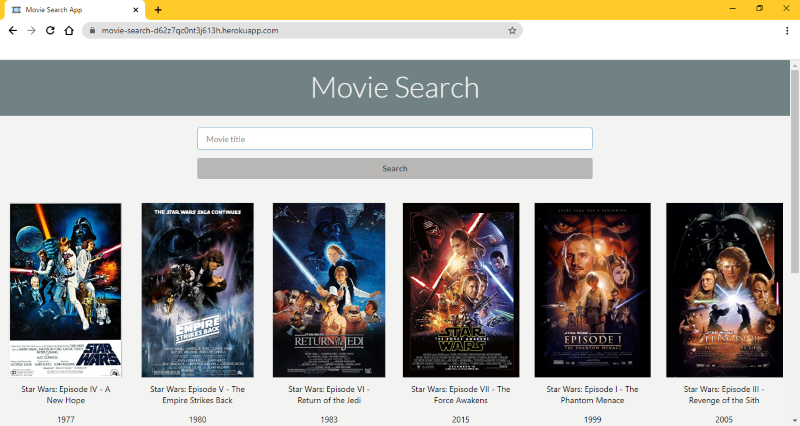
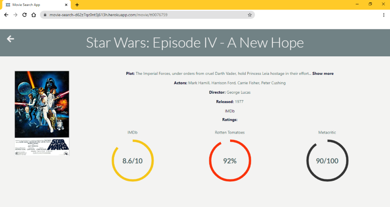

# Movie Search App

The app uses the OMDb api to find you movie info.

## Demo

Here is a working live demo: [https://movie-search-d62z7qc0nt3j613h.herokuapp.com/](https://movie-search-d62z7qc0nt3j613h.herokuapp.com/)

## Site

### Home

Enter a movie title and choose the movie you are interested in from the list. Click on a movie to see more info about it. 

#### In the background

When you click the Search button, first the app checks if the input is not empty, then it fetches the movies, that contains your input, from the OMDb api and displays it with the poster, title and release date. If the api can't fetch anything with the input, it displays an error.

### Movie info

The app displays the informations that are available: plot, actors, director and ratings from IMBd, Rotten Tomatoes and Metacritic, and a link to the movie's IMDb's profile.

#### In the background

When you click on a movie, the app fetches the movie information using the imdbID for an accurate search. It only displays a data if it's available. The plot only shows the first 100 characters, the Show more and Hide button toggle the full plot. The ratings are shown as donut charts with an animation on rendering the page. The IMDb link opens up a new tab.